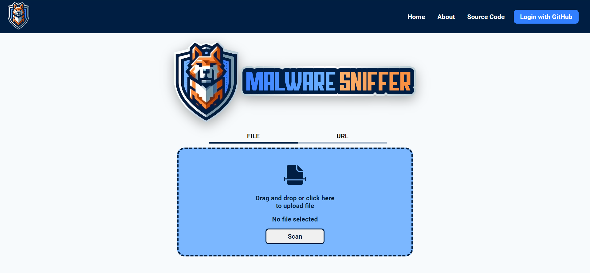
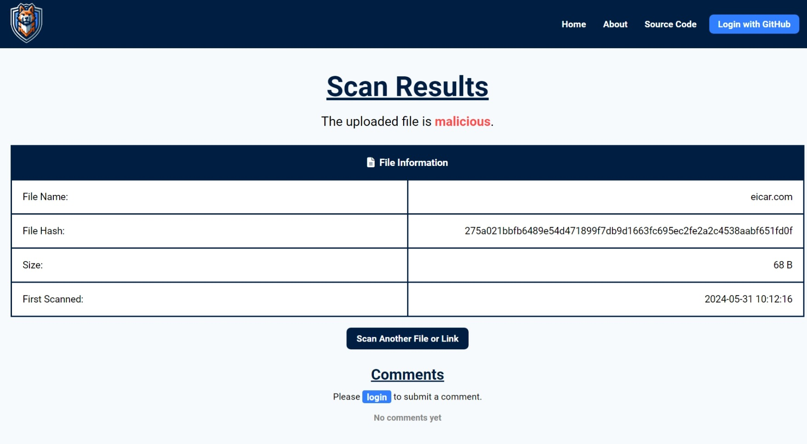

# Malware Sniffer

This is a web application that leverages machine learning to detect zero-day malware threats. Users can upload files or provide URLs, and the application will analyze them using advanced machine learning models to determine if they are malicious or benign.

## Features

- **File Upload**: Users can upload files, and the application will calculate the SHA-256 hash of the file to check if it has been analyzed before. If not, it will send the file to a Python script that uses the Malware-SMELL machine learning model for analysis.
- **URL Analysis**: Users can input URLs, which are then sent to a machine learning model powered by the Hugging Face API for analysis.
- **Database Integration**: The application stores the analysis results in a MySQL database, ensuring efficient lookups and avoiding redundant computations.
- **OAuth2 Authentication**: Users can log in using their GitHub accounts via OAuth2 authentication.
- **Commenting System**: Authenticated users can post comments on the application.

## Technology Stack

- **Front-end**: Thymeleaf, HTML, CSS, JavaScript
- **Back-end**: Spring Boot
- **Machine Learning**: Python
- **Database**: MySQL
- **Deployment**: AWS

## Screenshots





## Test the Web Application
The link to test the web application is currently down. Please check back later.

## Run the Application on Your Own Computer
To run Malware Sniffer on your own computer, you need to set the following environment variables:
```properties
spring.datasource.url=?
spring.datasource.username=?
spring.datasource.password=?
huggingface.api.key=?
spring.security.oauth2.client.registration.github.clientId=?
spring.security.oauth2.client.registration.github.clientSecret=?
```
Please replace the `?` with the appropriate values for your setup in the `application.properties` file (located in `malware-sniffer/src/main/resources`).

Also, make sure to create a MySQL database for the application using the SQL script provided (`malware-sniffer/database/malware_detection.sql`).

### Required Dependencies

Ensure you have the following dependencies installed on your computer:

- **Java** 17
- **Python** 3.10.11
- **Tensorflow** 2.15.0
- **Keras** 2.15.0
- **Scikit-Learn** 1.2.2
- **Numpy** 1.25.2
- **Tqdm** 4.66.2
- **MySQL**